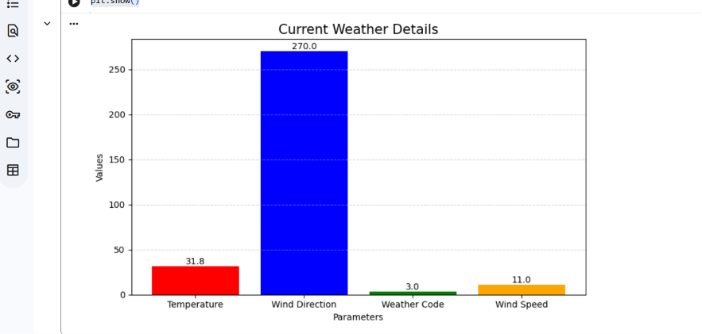

# 🌦️ Weather Data Analysis Using Python

A beginner-friendly Python project that fetches **live weather data** using the **Open-Meteo API**, extracts key weather information, and visualizes it using **Matplotlib**.

---

## 📖 Overview

This project demonstrates how to:

- Fetch real-time weather data from an API
- Extract useful weather parameters
- Visualize the data using a bar chart
- Perform basic data analysis in Python

It is an ideal project for beginners learning **Python, APIs, and Data Visualization**.

---

## 🚀 Features

- 🌡️ Live Weather Data
- 📡 API Integration
- 📊 Bar Chart Visualization
- 🐍 Simple Python Code
- 📄 Weather Report Generation

---

## 🛠️ Technologies Used

- Python 3
- Requests
- Matplotlib
- JSON
- Open-Meteo API

---

## 📂 Project Structure

```text
Weather-Data-Analysis/
│── weather_analysis.py
│── README.md
│── Current_Weather_Report.pdf
│── weather_chart.png
```

---

## 📊 Weather Parameters

The project extracts the following information:

| Parameter | Description |
|-----------|-------------|
| 🌡️ Temperature | Current temperature (°C) |
| 🧭 Wind Direction | Direction of wind (Degrees) |
| 🌥️ Weather Code | Current weather condition code |
| 💨 Wind Speed | Wind speed (km/h) |

---

## 📈 Sample Output

### Current Weather Details

| Parameter | Value |
|-----------|-------|
| Temperature | 31.8 °C |
| Wind Direction | 270° |
| Weather Code | 3 |
| Wind Speed | 11 km/h |

---

## 📊 Output Visualization

The program generates a bar chart representing:

- Temperature
- Wind Direction
- Weather Code
- Wind Speed

Example:



---


---


## 📚 Learning Outcomes

After completing this project, you will understand:

- Working with REST APIs
- JSON data parsing
- Python Requests library
- Data visualization using Matplotlib
- Real-world Python projects

---

## 📌 Future Enhancements

- 🌍 Multiple city support
- 📅 7-Day Weather Forecast
- 📈 Advanced Charts
- 💾 Save data to CSV or Excel
- 🖥️ Interactive Dashboard

---

## 📄 Report

A detailed project report is included in:

**Current_Weather_Report.pdf**

---


---

## 👩‍💻 Author

**Shalini Sharma**

**B.Tech – Computer Science Engineering (Data Analytics)**

---

## ⭐ Support

If you found this project helpful, please consider giving it a **⭐ Star** on GitHub.

It motivates me to build and share more real-world Python and Data Analytics projects.

---

> **"Data tells a story—Python helps us understand it."** 🚀
